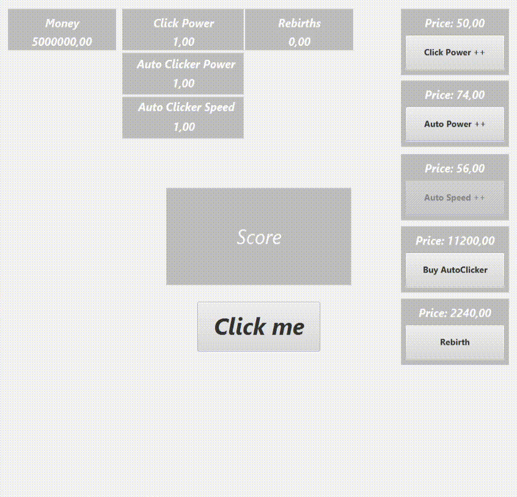

# 🎮 ClickerFX Game

Um jogo clicker simples, onde você clica para ganhar pontos, compra upgrades e realiza renascimentos.

---

## 🚀 Como rodar o projeto

1.  Clone este repositório.
2.  Abra o projeto em uma IDE de sua preferência (IntelliJ, Eclipse, etc.).
3.  Execute a classe `GameApp`.

---

## 🕹️ Funcionalidades

-   **Sistema de Clique:** ao clicar, os pontos são multiplicados pelo multiplicador de cliques definido na classe principal.
-   **Sistema de Loja (Shop):** todos os botões foram unificados em uma única função, utilizando `HashMap` para o mapeamento.
-   **Sistema de Renascimento (Rebirth):** ao realizar o renascimento, todos os upgrades são resetados, mas:
    -   Os upgrades têm seus valores incrementados permanentemente.
    -   O multiplicador aumenta, tornando cada upgrade mais poderoso a cada renascimento.

---

## 🔄 Atualizações futuras

-**Sistema de Salvamento (Save/Load):** Implementar um sistema para salvar e carregar o progresso do jogo (game state).
-**Sistema de Prestígio:** Em vez de apenas renascimentos (Rebirths), adicionar uma moeda de prestígio que o jogador ganha ao reiniciar, concedendo bônus permanentes.
-**Loja de Prestígio:** Criar uma nova loja onde será possível gastar as moedas de prestígio em melhorias permanentes que aumentam o poder do clique (Click Power) ou outros atributos.

---

## 🛠️ Tecnologias utilizadas

-   JavaFX
-   Maven
